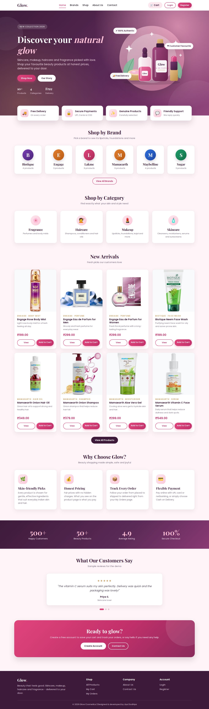
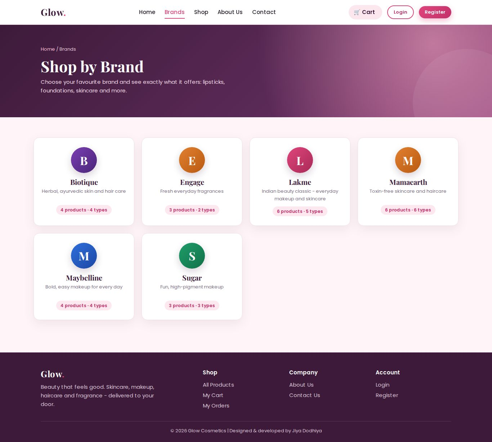
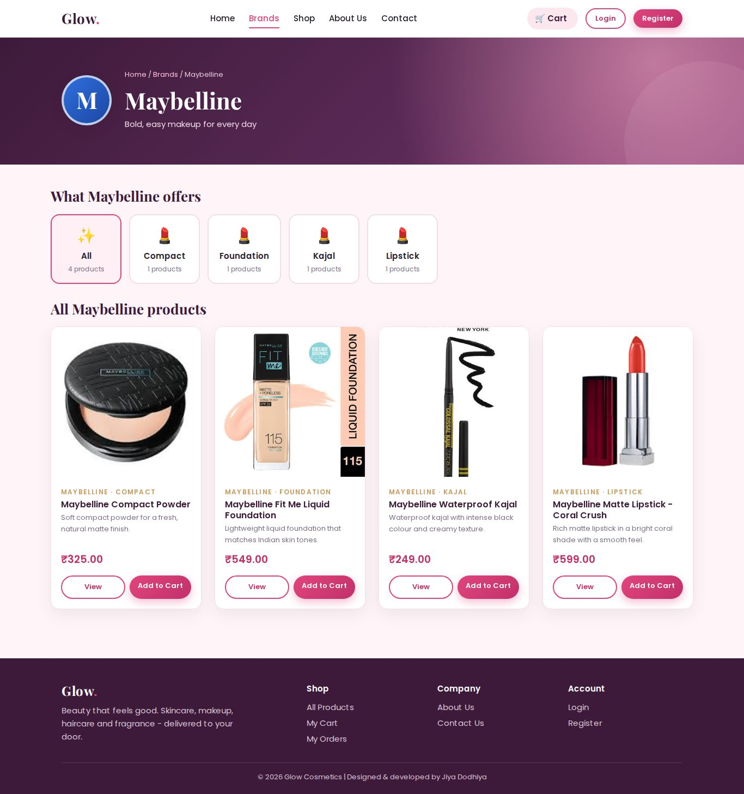
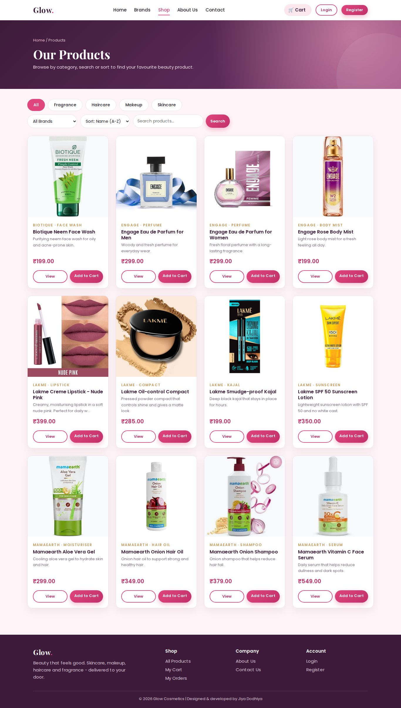
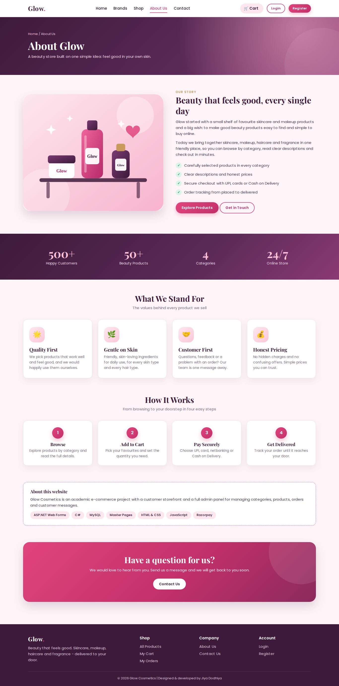
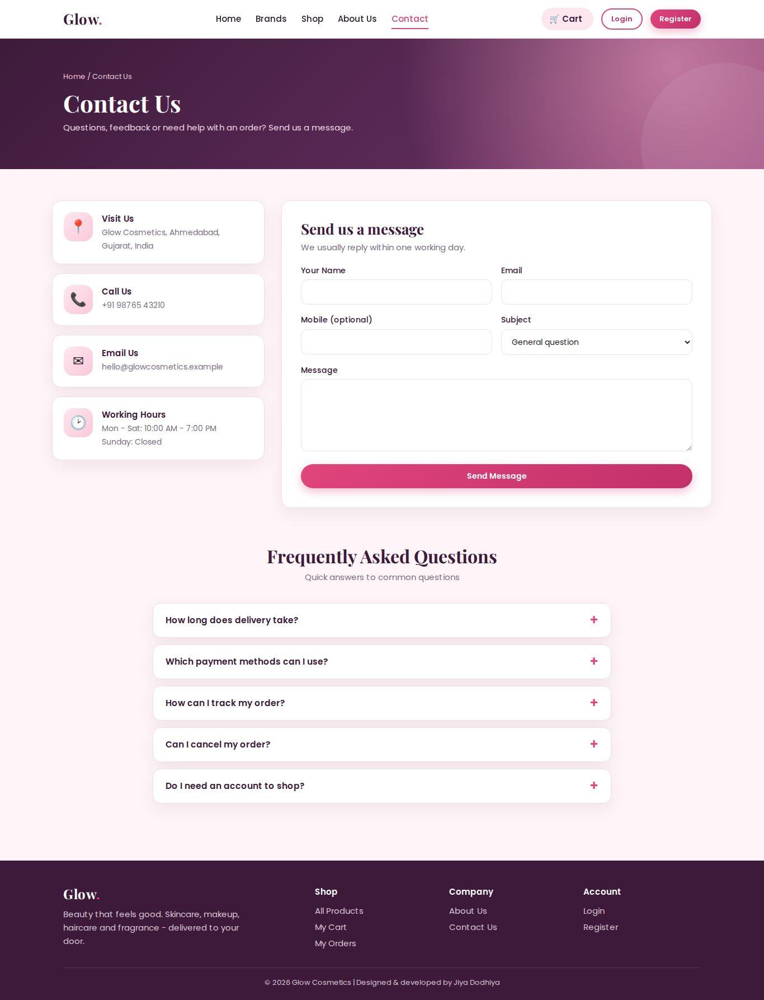
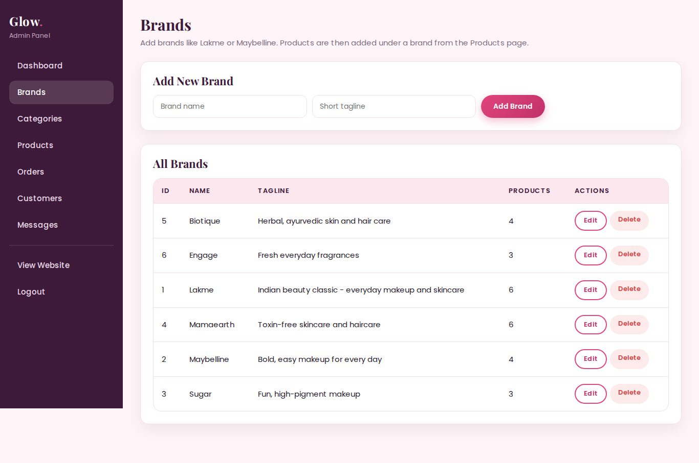
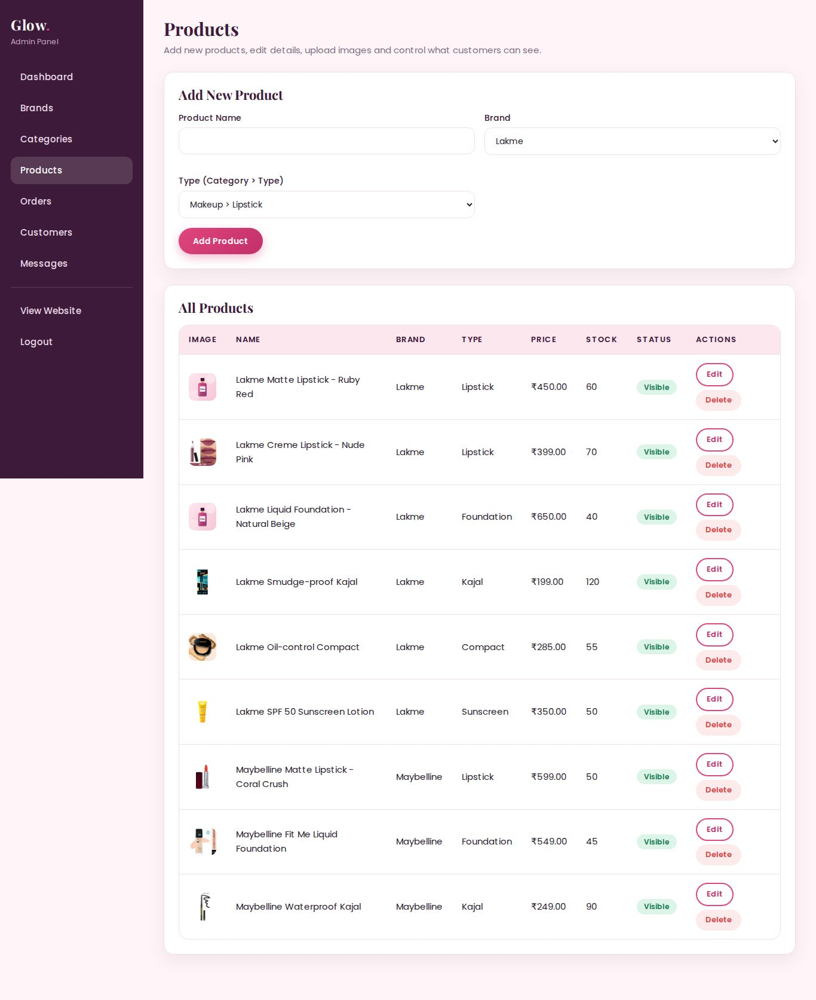
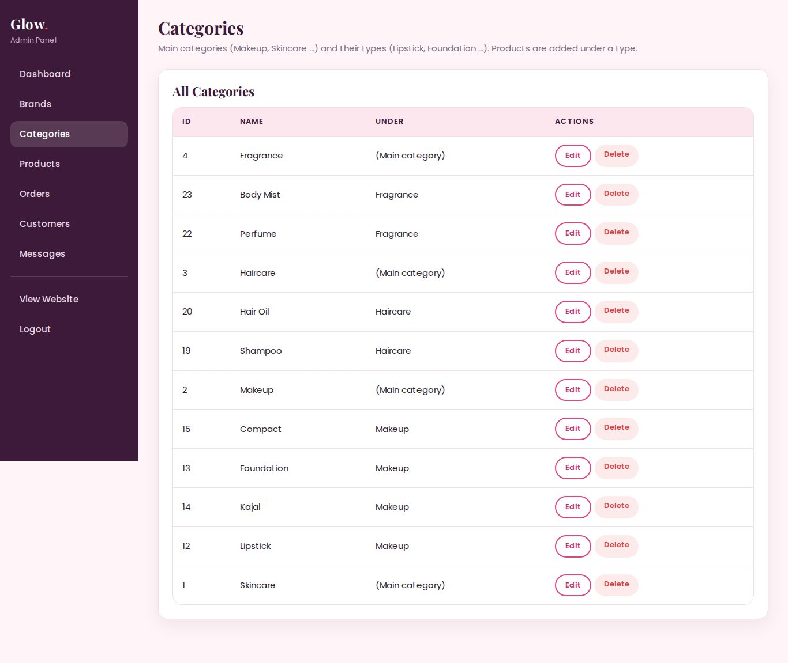

# Glow Cosmetics - Online Cosmetics Selling Website

A complete **e-commerce website for cosmetics** built with **ASP.NET Web Forms (C#)** and **MySQL**.
Customers can browse products **brand-wise and category-wise**, view details, add to cart, and pay online (Razorpay) or with Cash on Delivery.
The shop owner manages everything from a full **Admin Panel**.

> **Developed by Jiya Dodhiya**

---

## Highlights

- **Brand > Type > Product browsing.** Click a brand such as *Lakme* and you see only the types that brand really sells (Lipstick, Foundation, Kajal ...). Click a type and you see only that brand's products, so one brand's lipstick never mixes with another's.
- Modern, responsive, interactive UI: hero section, info cards, animated counters, testimonial slider, FAQ accordion, scroll animations, mobile menu.
- Pages: Home, Brands, Brand details, Products (search, category filter, brand filter, sorting), Product details, About Us, Contact Us, Cart, Checkout, Order success, My Orders (delivery tracker), Login, Register.
- Secure user register / login with **PBKDF2 hashed passwords** and session-based authentication.
- **Payment integration:** Razorpay (test mode, server-side signature verification) and Cash on Delivery.
- **Admin Panel:** dashboard, brands, categories and types, products (with image upload), orders (status update), customers, contact messages.

## Screenshots

> Screenshots use the sample data from `database.sql` with product photos added from the Admin Panel.

### Customer side

| Home | Brands |
|---|---|
|  |  |

| Brand page: Maybelline (its types and products) | Products |
|---|---|
|  |  |

| About Us | Contact Us |
|---|---|
|  |  |

### Admin panel

| Brands | Products |
|---|---|
|  |  |



## Technology Stack

| Layer | Technology |
|---|---|
| Front end | HTML5, CSS3 (custom design system), JavaScript (vanilla), ASP.NET Master Pages |
| Back end | ASP.NET Web Forms, C#, .NET Framework 4.8, OOP (base page classes, service classes) |
| Database | MySQL / MariaDB (`MySql.Data` connector, parameterised queries, transactions) |
| Payment | Razorpay Checkout (test mode) + Cash on Delivery |
| Tools | Visual Studio Community, IIS Express, XAMPP (MySQL), phpMyAdmin |

## How the Brand > Type > Product design works

```
categories  (parent_id = NULL)    ->  Makeup, Skincare, Haircare, Fragrance
categories  (parent_id = Makeup)  ->  Lipstick, Foundation, Kajal, Compact   (types)
brands                            ->  Lakme, Maybelline, Sugar ...
products    (brand_id + category_id = a type)
```

Every product belongs to exactly **one brand** and **one type**. The brand page runs a query that lists only the types that brand has products in, so the customer never sees an empty or unrelated section.

## Database

| Table | Purpose |
|---|---|
| `users` | customers and admin (role = user / admin), hashed passwords |
| `brands` | Lakme, Maybelline ... |
| `categories` | main categories and their types (self-reference using `parent_id`) |
| `products` | name, price, stock, image, brand, type, visibility |
| `cart` | one row per user and product |
| `orders`, `order_items` | order, shipping details, payment and delivery status |
| `contact_messages` | messages from the Contact Us page |

## Project Structure

```
Default.aspx, Brands.aspx, BrandDetails.aspx, Products.aspx, ProductDetails.aspx
About.aspx, Contact.aspx, Cart.aspx, Checkout.aspx, OrderSuccess.aspx, MyOrders.aspx
Login.aspx, Register.aspx, Logout.aspx
Site.master                  (shared layout: navbar + footer)
Admin/                       (Admin.master + Dashboard, Brands, Categories, Products, Orders, Users, Messages)
App_Code/                    (Db, Helper, BasePages, CartService, OrderService, Razorpay)
css/, js/, images/           (styles, interactive scripts, artwork)
database.sql                 (schema + sample data)
```

## How to Run Locally

1. **Start MySQL.** Open XAMPP Control Panel and click *Start* next to MySQL.
2. **Create the database.** Open `http://localhost/phpmyadmin`, click **Import**, choose `database.sql`, and click **Import**.
3. **Open the project.** In Visual Studio: *File > Open > Web Site* and select this folder.
4. **Set the connection string.** In `Web.config`, set `Pwd=` to your MySQL password. XAMPP has no password by default, so use `Pwd=;`.
5. **Install the MySQL connector.** *File > Save All*, then *Tools > NuGet Package Manager > Package Manager Console*:
   ```
   Install-Package MySql.Data -Version 8.0.33
   ```
6. **Run** with `Ctrl + F5`.

### Default admin login

| Email | Password |
|---|---|
| `admin@glow.com` | `Admin@123` |

Change this password before putting the site online.

### Online payment (Razorpay test mode)

1. Create a free account at razorpay.com and switch to **Test Mode**.
2. Generate test keys under *Account & Settings > API Keys*.
3. Put them in `Web.config`:
   ```xml
   <add key="RazorpayKeyId" value="rzp_test_xxxxxxxx" />
   <add key="RazorpayKeySecret" value="your_secret" />
   ```
4. Without keys, choose **Cash on Delivery** at checkout.

> Never commit real passwords or API secrets to GitHub.

## Notes

- Brand names, product names, prices and the Contact page details are **sample data** for demonstration. Edit them from the Admin Panel or `database.sql`.
- Customer reviews and statistics on the Home page are demo text.

## Developed By

**Jiya Dodhiya**
GitHub: [@jiyaa2711](https://github.com/jiyaa2711)
